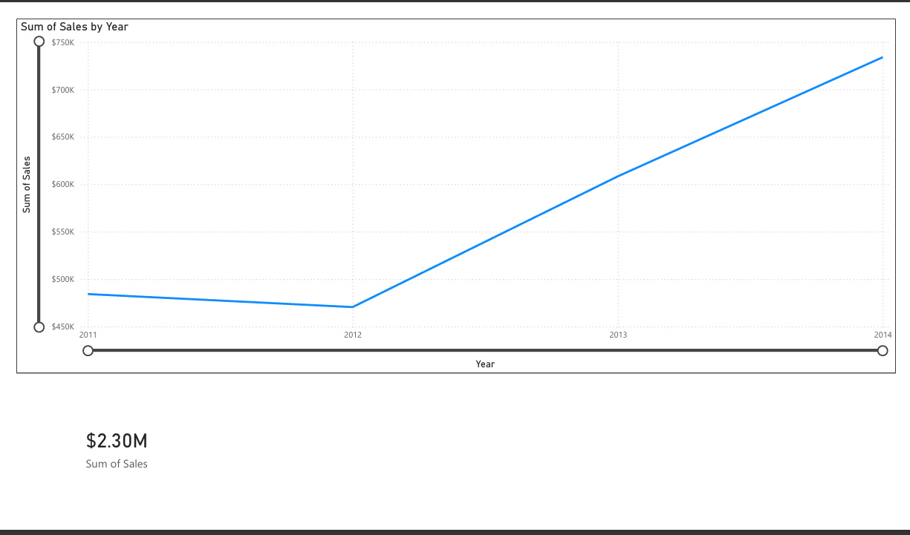

# Superstore Retail Analytics & Profitability Dashboard

## Project Overview
Designed and developed a comprehensive business intelligence dashboard to track e-commerce sales performance, identify profit-draining products, and optimize regional inventory distribution. 

**Tools Used:** Python (Pandas), SQL (SQLite), Power BI, Excel

## The Dashboard

*(View the full interactive PDF in the repository files).*

## Key Business Insights & Recommendations
As a Data Analyst, I processed over 10,000 transaction records and uncovered the following insights:

* **Profit Margin Discovery:** While the [Insert Category, e.g., Furniture] category generates high total revenue, it operates at a net loss in specific regions due to steep discounting. **Recommendation:** Restrict discount rates to a maximum of 15% on [Category] items in the [Insert Region] region.
* **Geographic Expansion:** The map visual indicates that [Insert State, e.g., California] and [Insert State, e.g., New York] account for the vast majority of profitable sales. **Recommendation:** Reallocate 20% of the marketing budget from underperforming central states to these high-converting coastal regions.
* **Product Optimization:** [Insert worst performing item] consistently loses money despite high sales volume. **Recommendation:** Discontinue this item or renegotiate wholesale buying prices with the supplier.

## Technical Methodology
1. **Data Extraction & Cleaning:** Used **Python (Pandas)** to extract raw CSV data, standardize column headers, handle missing values, and format datetime objects.
2. **Database Management:** Loaded the cleaned data into an **SQLite** database, writing SQL queries to aggregate overall profit and volume metrics.
3. **Data Visualization:** Connected **Power BI** directly to the structured data to build an interactive dashboard featuring financial KPIs, geographic mapping, and category-level profit tracking.
